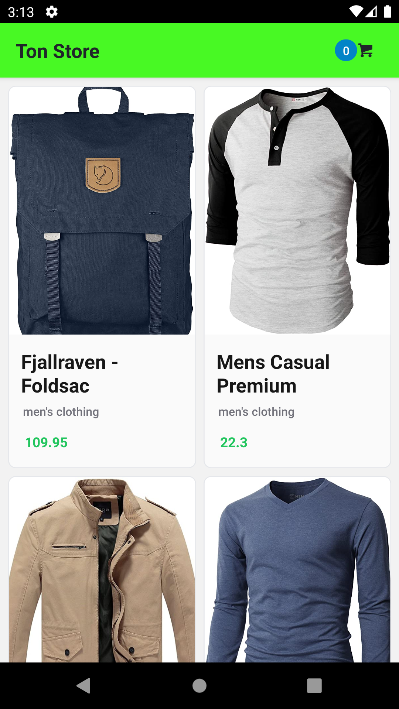

# Ton Store

Esse repositório é destinado ao teste front-end da Ton.



Mais imagens [aqui](./docs/)

Essa aplicação foi criada com [React Native](https://reactnative.dev/docs/environment-setup).

### Iniciando a aplicação e rodando testes

- Instalação da dependencias

```bash
    yarn
```

- rodando a aplicaçao no Android

```bash
    yarn android
```

- Rodando testes

```bash
    yarn test
```

- Rodando test e gerando o Coverage

> A cobertura está bem baixa. 🥲

```bash
    yarn test  -- --coverage
```

### Compilando APK

- Gerando sua chave unica

  ```bash
      keytool -genkey -v -keystore tonStore.keystore -alias tonStorekey -keyalg RSA -keysize 2048 -validity 10000
  ```

- acrecente os dados na chave arquivo `android/gradle.properties`

  ```
      MYAPP_RELEASE_STORE_FILE=my-release-key.keystore
      MYAPP_RELEASE_KEY_ALIAS=my-key-alias
      MYAPP_RELEASE_STORE_PASSWORD=****
      MYAPP_RELEASE_KEY_PASSWORD=****

  ```

- Gerando o APK com gradle

  ```bash
  cd android && ./gradlew assembleRelease
  ```
